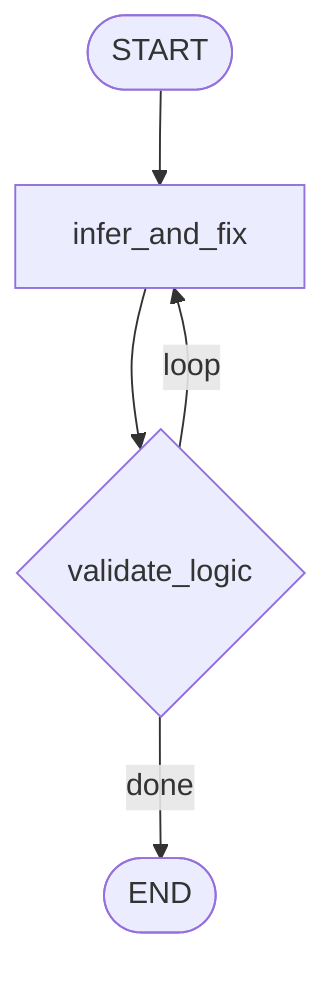
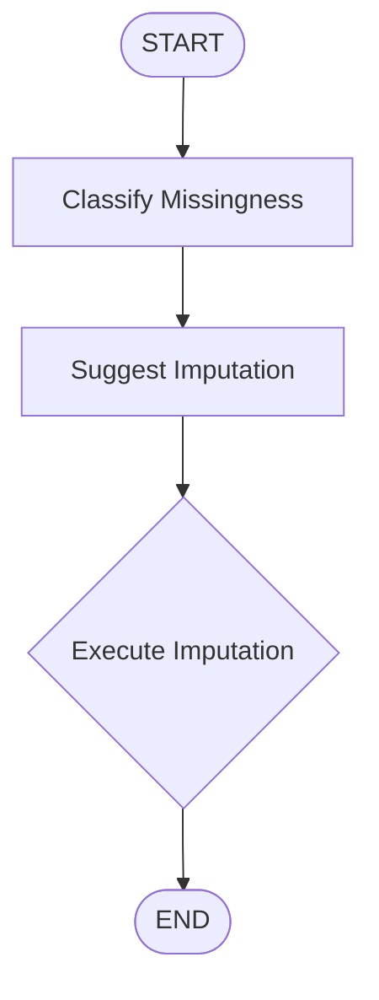

# **Project A.D.A.M. : Secure, Agentic Data Analysis & Automated Profiling**

## **1. Overview:**

Project A.D.A.M. is a production-grade, containerized agent based platform designed to automate end-to-end exploratory data analysis (EDA), data cleaning, and statistical profiling. 

By combining deterministic programmatic pipelines with LLM reasoning, the system takes raw, uncurated datasets and automatically generates comprehensive, insights-driven data reports with minimal human intervention.

## **2. Table of Contents:**
1. **[Overview](#1-overview)**
2. **[Table of Contents](#2-table-of-contents)**
3. **[Statistical Background](#3-statistical-background)**
    - **[Basics](#31-basics)**
    - **[Decision Matrix](#32-the-decision-matrix)**
    - **[Significance Level Correction](#33-significance-level-correction)**
        - **[Bonferroni Correction](#331-bonferroni-correction-controls-family-wise-error-rate)**
        - **[Benjamini Hochberg](#332-benjamini-hochberg-correction)**
4. **[Agentic Orchestration](#4-agentic-orchestration-the-langgraph-architecture)**
    - **[State Description](#41-state-of-langgraph)**
    - **[File and Targets Subgraph](#42-file-and-target-input-subgraph)**
    - **[Null Analysis Subgraph](#43-disguised-null-identification-subgraph)**
    - **[Type Validation Subgraph](#44-type-validation-subgraph)**
    - **[Missingness Analysis Subgraph](#45-missingness-analysis-subgraph)**

## **3. Statistical Background:**
### **3.1 Basics:**
All Statistical tests are based on hypothesises which are either proved right by the test and data or rejected.

So for all tests hypothesis testing follows the exact same logical steps. Firstly, three primary things are defined and set for the problem:
1. **Null Hypothesis ($H_0$):** This is the assumption that there is no effect, no difference, or no relationship between your variables.
2. **Alternate Hypothesis ($H_a$):** The claim that we are actually trying to prove. It states that there is a real effect, a significant difference, or a true relationship.
3. **Significance Level ($\alpha$):** It represents the maximum risk we are willing to take of being wrong if you claim a discovery.  Usually set at $0.05$ ($5\%$). Intuitively it explains that there is a $< 5 \%$ probability that the result we conclude on is wrong.

Upon fixing all these parameters for a given test we set on calculating the:
* **$P$-value:** The probability of getting the exact experimental results (or even more extreme results) purely by random luck,assuming that the null hypothesis is completely true.<br/>
    - Low $p$-value ($p < \alpha$): The data looks highly unusual under $H_0$. You reject $H_0$ and claim a discovery. <br/>
    - High $p$-value ($p \ge \alpha$): The data is completely consistent with random noise. You fail to reject $H_0$.

### **3.2 The Decision Matrix:**
|                                    | $H_0$ is Actually True<br/>(No Real Effect)              | $H_0$ is Actually False<br/>(Real Effect Exists)        |
|------------------------------------|-----------------------------------------------------|----------------------------------------------------|
| Reject $H_0$<br/>(Claim a Discovery)    | **Type 1** Error (**False Positive**)<br/>Probability = $\alpha$ | True Positive (Power)<br/>Probability = $1 - \beta$     |
| Fail to Reject $H_0$<br/>(Play it Safe) | True Negative<br/>Probability = $1 - \alpha$             | **Type 2** Error (**False Negative**)<br/>Probability = $\beta$ |   

### **3.3 Significance Level Correction:**
If we run a single hypothesis test with $\alpha = 0.05$, we have a $5\%$ chance of a False Positive. But if there are a 100 tests conducted at the same time using the same $\alpha$, the probability of getting at least one false positive jumps drastically:
$$\text{P(At least one False Positive)} = 1 - (1 - 0.05)^{100} \approx 99.4\%$$
If we don't correct your significance level when running multiple tests, the pipeline captures dozens of completely fake "discoveries" purely due to random chance. This is known as the **Multiple Comparisons Problem.**

#### **3.3.1 Bonferroni Correction (Controls Family-Wise Error Rate):**
The most conservative approach possible. It aims to guarantee that the probability of getting even a single false positive across your entire family of tests is less than $\alpha$.
* The Math: Divide the original significance level by the total number of tests ($m$):$$\alpha_{\text{new}} = \frac{\alpha_{\text{original}}}{m}$$
* Pros: Extremely safe. If it says a feature is significant, it means that with sureity that the probability of being wrong is $< (\alpha \times 100) \%$.
* Cons: It drives the threshold so low that it causes a massive spike in the number of Type 2 errors (Falsely sticking to $H_0$).

#### **3.3.2 Benjamini-Hochberg Correction:**
Instead of ensuring zero false positives, Benjamini-Hochberg (BH) controls the proportion of discoveries that are fake. If you set your False Discovery Rate (FDR) to $5\%$, it means you are completely fine if $5\%$ of your final accepted discoveries are false positives.
* **The Method:** Sort all your $m$ individual $p$-values in ascending order ($p_1 \le p_2 \le \dots \le p_m$). Assign each a rank $i$ (from $1$ to $m$). Find the largest rank $k$ such that:
$$p_i \le \left(\frac{i}{m}\right) \alpha$$
* Reject the null hypothesis for that specific test and all tests ranked below it.
* **Pros:** High statistical power. It scales dynamically based on the strength of your signals.
* **Cons:** Allows a small, controlled number of false positives into your final results, which requires downstream validation.

## **4. Agentic Orchestration: The LangGraph Architecture**

### **4.1 State of LangGraph:**
LangGraph follows a state based architecture, where the only common data passed along the graph between the nodes exists in a data structure called the state of the graph.

In this program the state of the graph is defined as follows:

```python
class GlobalState(BaseModel):
    current_info: Any = None
    current_data_info: DataAnalysis = DataAnalysis()
    log: str = ""
    user_input: str = ""

class DataAnalysis(BaseModel):
    file_path: str = Field(description="Path of the dataframe", default=None)
    targets: list[str] = Field(description="List of specific columns or variables to analyze", default=[])
    nulls: list[Union[str, int]] = Field(
        default=[],
        description="List of custom values to treat as NULL."
    )
    type_description: Dict[str, Tuple[str, Dict[str, str]]] = Field(
        description="Column name: (Type of data + Formatting)",
        default={}
    )
    page_data: Dict[int, Any] = Field(description="Page datas", default={})

    current_progress: int = Field(description="Current progress", default=0)
```

All of the fields described in the classes are pretty self explanatory and are description by their Field descriptions.

* **Current Info:** This variable describes any structures and data needed specific to the subgraph, hence it is set as type Any. The data structure changes based on the subgraph.
* **Current Data Info:** This is the persistent data being worked on and is passed throughout the graph so that each subgraph can perform its operations on the data.
* **Log:** This contains error logs and are used for routing between nodes in each of the subgraphs.
* **User Input:** This contains the user input pulled from the frontend.
* **Page Data:** This is a dictionary of the data required by the frontend for each page, such that it can be supplied whenever user switches between pages.

---

### **4.2 File and Target Input Subgraph:**
#### **4.2.1 Aim:**
The aim of this node is to take the file path, the targets for analysis (just for marking, in case this is ever used in combination with an entire Auto-ML pipeline), and verify if the target columns exist within the specified file.

#### **4.2.2 State:**
The rest of the state remains the same, but the `current_info` is changed to an object of type `PathInformation`

```python
class PathInformation(BaseModel):
    file_path: str = Field(
        default="",
        description="The source/input data file path to be read. Keywords: 'load', 'read', 'from', 'input', 'analyze'."
    )
    all_columns: List[str] = Field(description="List of all columns in the dataset", default=[])
    rows: int = Field(description="Total number of rows in the dataset", default=0)
    analysis_targets: list[str] = Field(
        default=[],
        description="A list of specific column names or variables to focus on (e.g., ['SalePrice', 'Age'])."
    )
    missing_fields: list[Literal["file_path", "analysis_targets"]] = Field(
        default=["file_path", "analysis_targets"],
        description="A tracking list of which required fields are currently empty."
    )
```

#### **4.2.3 Graph Flow:**

As of now the the system only supports excel and .csv files. The file box in the front-end restricts user inputs to files of these formats. Upon receiving the file path, the system prompts for the analysis targets. 

Depending on the user reply the graph-flow is routed to either, the parser node for parsing if it is a data related response or the convo node for general questions and conversation about the state or otherwise. (The routing is done by setting the `log` variable)

The convo node leads back to the prompt node for reprompting.

The parser node takes a human language command and modifies the targets accordingly (E.g. "Add Var-A to the targets" -> New State contains Var-A in the targets list). Upon parsing the data is sent to the loader node for verification.

The loader node's job is to load the dataframe uploaded and verify if all of the specified targets exist. If not it is routed back to the prompt node, to ask for the targets.

If the loader node verifies that all targets exist within the analysis file, it then continues to the post-prompt node, in which the user is given a quick summary of the current state (targets + file uploaded). 

The user may decide to change any of the data, in which case it is redirected to the parser node for re-parsing and verification, or the user may question the agent based on the current state, in which case it is redirected to the post prompt node.

The graph redirects back to the post prompt node from the convo node instead of the prompt node if the data is already verified.

#### **4.2.4 Graph Visualization:**


---

### **4.3 Disguised Null Identification Subgraph:**
#### **4.3.1 Aim:**
The aim of this node is to search and replace disguised nulls (E.g. -999, 'nothing', etc with the `pandas` standard `null`). It has a default list of nulls as follows, and additionally prompts the user to supply any addition nulls that might be present in the data.

```python
self.null_values = [
    "None", "nan", "NaN", "NAN", "null", "NULL", "undefined", "Undefined",
    "n/a", "N/A", "na", "NA", "n.a.", "N.A.", "n/p", "not available", "not applicable",
    "?", "-", "--", "---", ".", "...", "missing", "Missing", "MISSING", "unknown", "Unknown",
    "", " ", "  ", "\t", "\n", "none",
    -1, -99, -999, -9999, 0, 999, 9999, "999", "9999", "0", "-1",
    "#N/A", "#N/A N/A", "#NA", "-1.#IND", "-1.#QNAN", "-NaN", "-nan", "1.#IND", "1.#QNAN",
    "0000-00-00", "01-01-1970", "1900-01-01", "NaT", "nat"
]
```

#### **4.3.2 State:**
The `current_info` is changed to an object of type `PathInformation`

```python
class NullCleanupInfo(BaseModel):
    nulls: list[Union[str, int]] = Field(
        default=[],
        description="List of values to treat as NULL."
    )

    nulls_report: list[Any] = Field(description="List of all the documents to add to vector db", default=[])
```

* **nulls_report:** it is just a list of the `documents` / `texts` which is later added to the vector database for querying. Each of the documents is of the format:

```python
txt = (
    f"'{null}' identified as a disguised null, found {int(total_sum)} times in columns: "
    f"{', '.join([str(i) for i in affected_cols])}"
)
```


#### **4.3.3 Graph Flow + Visualisation:**
The graph is almost identical to the File and Targets Subgraph, the only difference being that the `main node` (loader node) is replaced with the `null node`.

The `null node` replaces the suspected null with the `pandas` standard `null`. It also records how many of each null is found and in which all columns, so that it may be stored and queried later.

---

### **4.4 Type Validation Subgraph:**
#### **4.4.1 Aim:**
This subgraph, determines the type and format of a column, given its first few entries, suspected type (whatever `pandas` loaded it as) and column name. It then decides the intended type and any formatting (E.g. suffixes, prefixes and formats for datetime)


#### **4.4.2 State:**
The `current_info` now takes the class of `ColParsingData`.

```python
class ColParsingData(BaseModel):
    col_name: str = Field(description="Column name", default="")
    df_path: str = Field(description="File path", default="")
    col_type: Literal["numeric", "category", "text", "datetime", "timedelta"] = Field(description="Inferred type of column",
                                                                         default="numeric")
    col_formatting: Dict[str, str] = Field(
        description="Formatting steps (prefix, suffix, or datetime-format)",
        default_factory=dict
    )
    col_data: List[Any] = Field(description="List of first 20 elements in Column", default=[0] * 20)
    col_error: str = Field(description="Error occurred during parsing", default="")
    iterations: int = Field(description="Number of iterations performed", default=0)
    max_iterations: int = Field(description="Maximum number of iterations performed", default=5)

```
All of the variable are described by their Field descriptions.

#### **4.4.3 Graph Flow:**
The Subgraph uses an llm to find the suspected type and formatting data of each column. It is a very small and simple subgraph which is visualised below, and is run for each and every column.


#### **4.4.4 Graph Visualization:**


---

### **4.5 Missingness Analysis Subgraph:**
#### **4.5.1 Aim:**
This subgraph, determines the type and severity of missingness of a column. Based on this data, it proposes the method of imputation. It then executes the imputation to fill in all the missing values.

#### **4.5.2 Theory:**
The decision of type of imputation is based on severity and type of missigness. There are 3 types of missingnesses:
1. **MCAR:** The probability of a data point being missing is entirely independent of both the observed data and the unobserved missing values themselves. It is pure, unbiased noise.
$$P(\text{Missing} \mid \text{Observed}, \text{Unobserved}) = P(\text{Missing})$$
2. **MAR:** The missingness is not random, but it can be completely explained by other observed variables in the dataset. The missing values do not depend on the missing values themselves, but on some other known columns.
$$P(\text{Missing} \mid \text{Observed}, \text{Unobserved}) = P(\text{Missing} \mid \text{Observed})$$
3. **MNAR**: The probability of missingness depends directly on the hypothetical value itself, or on unobserved factors. The reason it is missing is bound to the missing information.
$$P(\text{Missing} \mid \text{Observed}, \text{Unobserved}) \neq P(\text{Missing} \mid \text{Observed})$$

The imputations performed can be summarised in the following `3D matrix` of 
1. **Severity:** `[0, 5]` , `(5, 30]`, `(30, 60]`, `(60, 100]`
2. **Type of missingness:** `MAR`, `MAR`, `MNAR`
3. **Type of data:** `numeric`, `categoric`, `datetime`, `timedelta`

hence it is a `4 x 3 x 4` matrix.

* For `numeric` datatype the imputations are as follows:

|        | MCAR          | MAR                | MNAR          |
|--------|---------------|--------------------|---------------|
| 0-5    | Simple Median | Conditional Median | Simple Median |
| 5-30   | Simple Median | Conditional Median | Escalate      |
| 30-60  | MICE          | Regressor          | Escalate      |
| 60-100 | Drop          | Drop               | Drop          |

* For `categorical` datatype the imputations are as follows:

|        | MCAR        | MAR              | MNAR         |
|--------|-------------|------------------|--------------|
| 0-5    | Simple Mode | Conditional Mode | Constant UNK |
| 5-30   | Simple Mode | Conditional Mode | Escalate     |
| 30-60  | Regressor   | Regressor        | Escalate     |
| 60-100 | Drop        | Drop             | Drop         |

* For `datetime` datatype the imputations are as follows:

|        | MCAR                  | MAR                      | MNAR                  |
|--------|-----------------------|--------------------------|-----------------------|
| 0-5    | Constant Forward-fill | Conditional Forward-fill | Constant Forward-fill |
| 5-20   | Constant Forward-fill | Conditional Forward-fill | Escalate              |
| 20-60  | Simple Median         | Conditional Median       | Escalate              |
| 60-100 | Drop                  | Drop                     | Drop                  |

* For `timedelta` datatype the imputations are as follows:

|        | MCAR          | MAR                | MNAR          |
|--------|---------------|--------------------|---------------|
| 0-5    | Simple Median | Conditional Median | Simple Median |
| 5-20   | Simple Median | Conditional Median | Escalate      |
| 20-60  | KNN           | Conditional Median | Escalate      |
| 60-100 | Drop          | Drop               | Drop          |

Now a brief description of the implementation and explanation of the imputation methods described above.

1. **Simple Statistical: (Median / Mode)** This is the simplest imputation, where the missing values are imputed with the `median` or `mode` of the remaining values in the column.
2. **Conditional Statistical: (Median / Mode / Forward-Fill)** The main logic with conditional statistical impuptation is to group the column under observation based on the closest related column, and then impute each group as needed.<br/>
Forward-Fill refers to the imputation technique, where the last available value in the column is used to fill the missing values.<br />
Now, how do we decide which column is the most related to the column which we have to impute (`Impute Target`)? This is done with the help of similarity metrics between the columns, the metrics depending on the data type of the columns described below. The mathematics of these metrics are discussed in the [Multivariate Subgraphs Section.](#)

|                                  | Category    | Numerical / Datetime / timedelta |
|----------------------------------|-------------|----------------------------------|
| Category                         | Cramer's V  | Eta Squared                      |
| Numerical / Datetime / timedelta | Eta Squared | Spearman coeffecient             |
3. **Model Based Imputation:**
    - **KNN: (K-Nearest-Neighbours)** It calculates the distance (usually Euclidean distance) between the row with the missing value and all other complete rows based on the features they share. It identifies the $k$ closest rows (the "neighbors") and takes the average (or weighted average) of their values to fill in the blank. <br />
    The Distance is calculated using `nan_euclidean` distance function which calculates the euclidean distance for the intersection of `non-nan` values in both the rows being compared. <br />
    Since this performs pair-wise comparisons, it is an $O(n^2)$ operation and is very memory and time ineffecient.

    - **Regressor:** The imputer isolates the specific column that has missing values. 
        - It splits the dataset into two, the **Training Set** (All rows where the column is fully known) and the **Prediction Set** (All rows where Salary is blank.) <br/>
        - A standard regression model (like a standard LinearRegression() or a single decision tree) is fit on that training data. The model learns the exact mathematical relationship between the known features and the target.
        - The feature columns ($X$) of the prediction set are passed into the trained model. The model outputs its best guesses, and those predicted values are dropped directly into the missing holes.

    - **MICE: (Multiple-Imputation-by-Chained-Imputations)** handles missing values by turning every column with gaps into a machine learning target. <br />
        - **The Setup:** It initially fills all missing values with a quick placeholder (by default, the column mean).
        - **The First Loop:** It picks the first column that has missing data. It treats this column as the target ($y$) and all other columns as features ($X$).
        - **The Tree Ensemble:** It trains an estimator (ExtraTreesRegressor is the one used in the program) on the rows where $y$ was originally known. Then, it uses that trained model to predict and overwrite the placeholders in the rows where $y$ was missing.
        - **The Chained Sequence:** It moves to the next column with missing data, using the freshly updated values of the first column to help predict the second one. 
        - It repeats this until every column with missing data has been updated once.
        - Doing this once isn't enough because the early predictions relied on basic mean placeholders. So, the imputer runs through the entire dataset loop `n` times (10 in the program). 
        - Each pass uses cleaner, more refined data from the previous round to make better predictions.

#### **4.5.3 State:**
The State of the graph remains the same as the previous subgraph, and the current subgraph works on the data present in the `current_data_info` structure.

#### **4.5.4 Graph Flow + Visualization:**
The subgraph starts its execution by identifying the severity and type of missingness for each column. It then identifies the most appropriate missingness and processes it into a `Missingness.csv` which contains all the details of the analysis (Severity, type of column, type of missingness, suggested imputation method, imputation value, etc). The graph then executes the suggested imputation to fill in the missing values.



---

### **4.6 Univariate Analysis:**
#### **4.6.1 Aim:**
The main aim of univariate analysis is to calculate standard univariate metrics and store them for retrieval and querying by the agent later.

#### **4.6.2 Graph Flow + Theory:**
Based on the datatype of the column the following attributes are calculated:

1. **Numerical Datatype: (Numeric, Datetime, Timedelta)**

* **Central Tendency & Basic Dispersion:**

| Attribute | Explanation | Formula / Condition |
| --- | --- | --- |
| Mean | The arithmetic average of all values in the column. | $$\mu = \frac{1}{n} \sum_{i=1}^{n} x_i$$|
|Median | The exact middle value of the dataset when arranged in ascending order. | $\tilde{x} = \begin{cases} x_{\frac{n+1}{2}} & n \text{ is odd} \\frac{1}{2}\left(x_{\frac{n}{2}} + x_{\frac{n}{2}+1}\right) & n \text{ is even} \end{cases}$ |
| Mode | The most frequently occurring value (or values) in the column vector. | $$\arg\max_{x} \text{Count}(x)$$|
|Standard Deviation | Measures the average distance of individual data points from the column's mean. | $$\sigma = \sqrt{\frac{1}{n-1} \sum_{i=1}^{n} (x_i - \mu)^2}$$|
| Variance | The average of the squared deviations from the mean, quantifying overall data spread. | $$\sigma^2 = \frac{1}{n-1} \sum_{i=1}^{n} (x_i - \mu)^2$$|

* **Metadata & Structural Checks:**

| Attribute | Explanation | Formula / Condition |
| --- | --- | --- |
| low_variance | Flags whether the column is nearly constant, containing negligible informational variety. | $$\text{Var}(X) \le 0.05$$|
| is_id | Identifies whether the sequence behaves like an auto-incrementing database primary key. | $\text{All Unique} \land \text{Diffs Regular} \land \text{Cardinality} = n$|
| signage | Classifies the underlying data values as purely positive, purely negative, or mixed. | $$\text{Map to } \{\text{"positive"}, \text{"negative"}, \text{"mixed"}\}$$|
| zero | A Boolean indicator flagging if the exact value of zero is present within the column. | $$\exists \, x_i \in X : x_i = 0$$|

* **Advanced Shape & Distribution Metrics:**

| Attribute | Explanation | Formula / Condition |
| --- | --- | --- |
| skew | Measures distribution asymmetry; positive implies a long right tail, negative a long left tail. | $$\gamma_1 = E\left[\left(\frac{X-\mu}{\sigma}\right)^3\right]$ |
| kurtosis | Measures tail-heaviness (Fisher’s definition), highlighting extreme outlier density relative to a normal curve. | $$\gamma_2 = E\left[\left(\frac{X-\mu}{\sigma}\right)^4\right] - 3$$|
| coeff_of_variation | Standardizes dispersion relative to the mean, allowing variance comparisons across columns with different scales. | $$CV = \frac{\sigma}{\mu}$$|
| MAD | Median Absolute Deviation; a robust alternative to standard deviation showing average absolute distance around the center. | $$\text{Median}(\|X - \tilde{x}\$$|
| distribution_type | Categorizes the global data shape into left-skewed, right-skewed, multi-modal, uniform, or symmetric. | Calculated using Hartigan's Dip Test $p$-value and $\gamma_1$ bounds |
| normal | Evaluates whether the column matches a normal (Gaussian) bell curve at the designated significance level. | Shapiro-Wilk ($n < 5000$) else D'Agostino-Pearson $p\text{-value} > \alpha$ |

* **Range, Percentiles & Outlier Assessment:**

| Attribute | Explanation | Formula / Condition |
| --- | --- | --- |
| percentiles | Identifies value thresholds below which a specific percentage $p$ of the data points fall. | $$Q(p) = x \text{ where } P(X \le x) = p \\ \text{for } p \in \{0.01, 0.05, 0.25, 0.50, 0.75, 0.95, 0.99\}$$|
| iqr | Interquartile Range; captures the spread of the middle 50% of the dataset. | $$IQR = Q_{0.75} - Q_{0.25}$$|
| range | The absolute mathematical distance between the absolute maximum and minimum values. | $$\text{Max}(X) - \text{Min}(X)$$|
| extreme_outliers | Flags severe right-tail spikes where the max value dwarfs the middle spread by an order of magnitude. | $$Q_{0.99} > 3 \cdot IQR \land \text{Max}(X) > 3 \cdot IQR$$|
| IQR_outliers | Isolates data points that reside far outside standard interquartile fences (Tukey's method). | $$\{x \in X : x < Q_{0.25} - 1.5 \cdot IQR \lor x > Q_{0.75} + 1.5 \cdot IQR\}$$|
| IQR_pc | The percentage of rows in the dataset flagged as standard Tukey IQR outliers. | $$\frac{\|\text{IQR\_outliers}\|}{n} \times 100$$|
| Z_outliers | Identifies records carrying an absolute standard score greater than 3 (more than 3 standard deviations away). | $$\left\{x \in X : \left\|\frac{x-\mu}{\sigma}\right\| > 3\right$$|
| Z_pc | The percentage of records in the dataset flagged as traditional Z-score outliers. | $$\frac{\|\text{Z\_outliers}\|}{n} \times 100$$|
| outlier_flag | A systemic binary flag that trips if more than 5% of the total dataset is flagged by either outlier framework. | $$\text{True if } IQR\_pc > 5.0\% \lor Z\_pc > 5.0\%$$|
| bottom_5 | Returns the five lowest sorted numerical values present in the column matrix. | First 5 index elements of sorted vector $X_{asc}$ |
| top_5 | Returns the five highest sorted numerical values present in the column matrix. | Last 5 index elements of sorted vector $X_{asc}$ |

* **Feature Engineering Recommendation**

| Attribute | Explanation | Formula / Condition |
| --- | --- | --- |
| transform | Proposes a mathematical transformation to stabilize variance and normalize heavy skews based on distribution limits. | If $\gamma_1 > 1.0 \land \text{Min}(X) > 0 \rightarrow \text{"log" or "box-cox"}$<br/>If $\gamma_1 > 1.0 \land \text{Min}(X) = 0 \rightarrow \text{"yeo-johnson" or "sqrt"}$ |


2. **Categorical Datatype:**
Here is the structured breakdown of the attributes calculated in your categoricalColumnAnalysis function, formatted precisely according to your structural schema.


* **Structural Cardinality & Encoding Framework:**

| Attribute | Explanation | Formula / Condition |
| --- | --- | --- |
| cardinality | Counts the number of unique categorical classes present in the column. | - |
| suggested_merge_categories | Lists categories with extremely low absolute sample representations, making them ideal targets for merging into an "Other" bucket. | $\{c \in U : \text{Count}(c) < 50\}$ |
| cardinality_after_merge | Computes the prospective unique class count assuming all low-representation categories are collapsed into a single unified bin. | - |
| cardinality_tier | Broadly categorizes the column's variety density into discrete operational tiers (binary, low, medium, high, very-high). | Conditional bins on cardinality at thresholds: $2, 10, 50, 200$ |
| encoding | Recommends an optimal machine learning vectorization strategy based on the feature's dynamic cardinality profile. | Map to label, OHE, target, or hashing based on tier bounds |

* **Metadata & Structural Checks:**

| Attribute | Explanation | Formula / Condition |
| --- | --- | --- |
| frequency | A foundational distribution mapping tracking raw value occurrences alongside their relative representation metrics. | $\text{DataFrame}[\text{Count}(c), \text{Percent}(c)] \quad \forall c \in U$ |
| rare | Identifies categories whose structural footprint accounts for less than 1% of the entire column matrix. | $\{c \in U : \text{Percent}(c) < 1\%\}$ |
| binary_flag | A Boolean indicator that flags whether the feature space is strictly composed of exactly two distinct categories. | $\text{True if } cardinality = 2$ |
| high_card_flag | Signals whether the categorical feature features a dense variety boundary that could trigger dimensionality explosions. | $\text{True if } cardinality > 50$ |
| suspected_text | Flags columns containing long free-form natural language strings rather than structured categorical labels. | $cardinality\_tier = \text{"very-high"} \land \text{Mean}(\text{len}(x_i)) > 150$ |

* **Information Theory & Information Concentration Metrics:**

| Attribute | Explanation | Formula / Condition |
| --- | --- | --- |
| top-percentages | Calculates the running cumulative distribution share dominated by the largest 1, 3, and 5 categories. | $\sum_{j=1}^{i} \text{Percent}(c_j) \text{ for } i \in \{1, 3, 5\} \text{ sorted descending}$ |
| entropy | Evaluates structural uncertainty normalized by total unique cardinality; a value near 1 implies a perfectly uniform class distribution. | $H_{norm}(X) = \frac{-\sum_{c \in U} p(c) \log_2 p(c)}{\log_2(\| U \|)}$ |
| gini | Computes the operational impurity profile, standardized against the maximum achievable diversity boundary of the categorical shape. | $$G_{norm}(X) = \frac{1 - \sum_{c \in U} p(c)^2}{1 - \frac{1}{\| U \|}}$$ |

* **Target Variable Imbalance Assessment:**

> *Note: These evaluation attributes are explicitly compiled only if the structural flag target=True is fed to the analysis block.*

| Attribute | Explanation | Formula / Condition |
| --- | --- | --- |
| imbalance_ratio | Quantifies the representation disparity by evaluating the scale difference between the majority class and minority class. | $IR = \frac{\max_{c \in U} \text{Count}(c)}{\min_{c \in U} \text{Count}(c)}$ |
| imbalance_tier | Striates the target column's distribution into distinct systemic risk tiers, moving from Balanced out to Extremely Imbalanced. | Conditional classes mapped on $IR$ thresholds at: $1.5, 3, 10, 100$ |
| metric | Selects robust optimization and validation tracking metrics that remain statistically resilient against heavy category skews. | Assigns metric pairings (e.g., MCC, PR-AUC, F1) based on severity |
| handling | Outlines architectural recommendations (resampling pipelines or specialized loss weights) required to stabilize downstream classifiers. | Recommends algorithmic adjustments (e.g., SMOTE, EasyEnsemble, Weights) |

