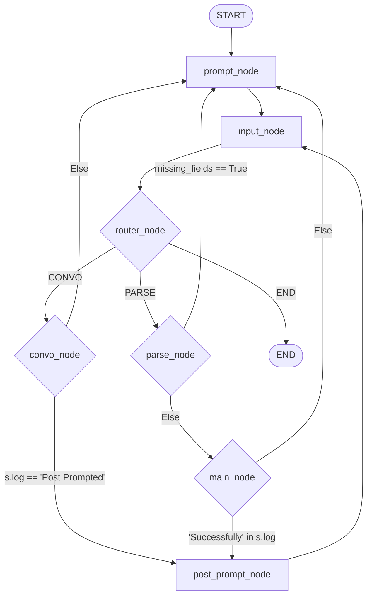
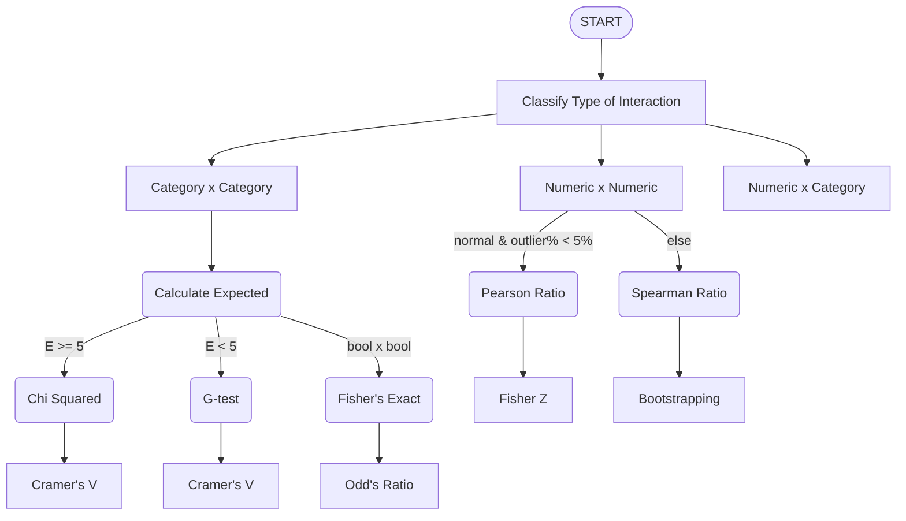
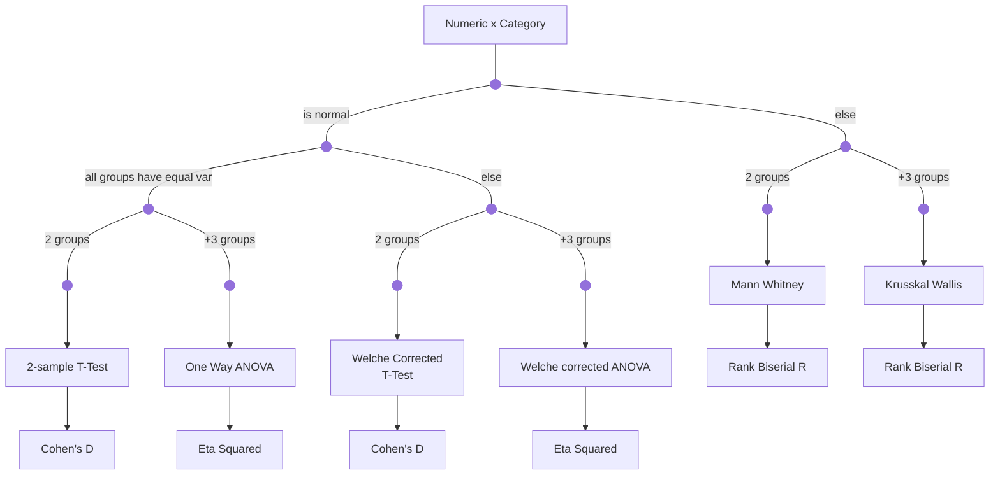
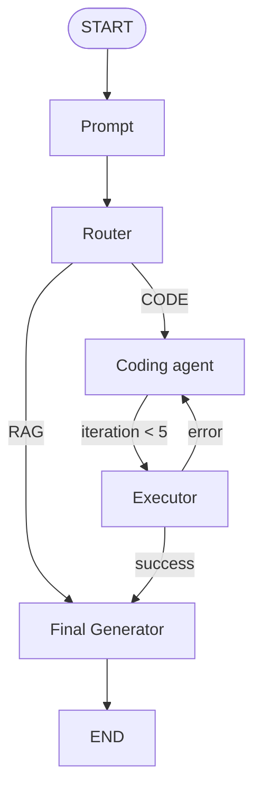
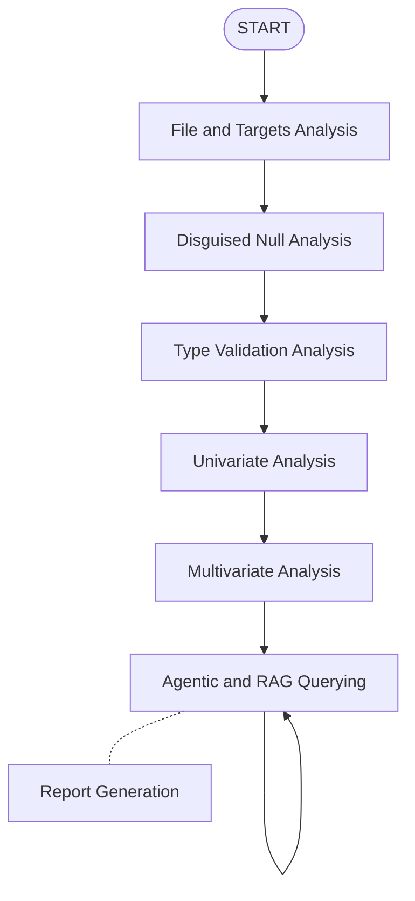
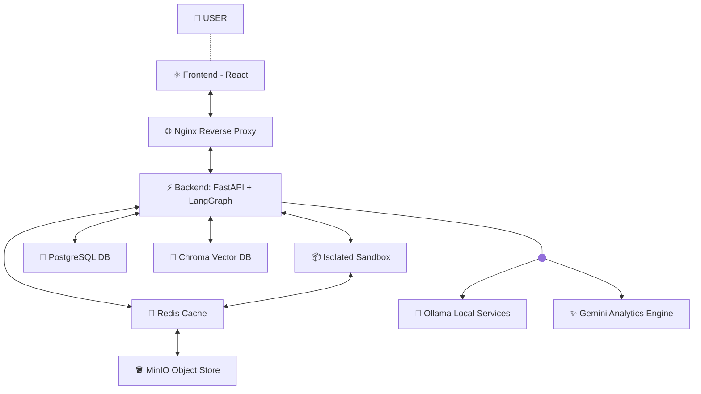

# **Project A.D.A.M. : Agentic Data Analysis Manager**

## **1. Overview:**

Project A.D.A.M. is a production-grade, containerized agent based platform designed to automate end-to-end exploratory data analysis (EDA), data cleaning, and statistical profiling. 

By combining deterministic programmatic pipelines with LLM reasoning, the system takes raw, uncurated datasets and automatically generates comprehensive, insights-driven data reports with minimal human intervention.

## **2. Table of Contents:**
1. **[Overview](#1-overview)**
2. **[Table of Contents](#2-table-of-contents)**
3. **[Statistical Background](#3-statistical-background)**
    - **[3.1 Basics](#31-basics)**
    - **[3.2 Decision Matrix](#32-the-decision-matrix)**
    - **[3.3 Significance Level Correction](#33-significance-level-correction)**
        - **[3.3.1 Bonferroni Correction](#331-bonferroni-correction-controls-family-wise-error-rate)**
        - **[3.3.2 Benjamini Hochberg](#332-benjamini-hochberg-correction)**
4. **[Agentic Orchestration](#4-agentic-orchestration-the-langgraph-architecture)**
    - **[4.1 State Description](#41-state-of-langgraph)**
    - **[4.2 File and Targets Subgraph](#42-file-and-target-input-subgraph)**
    - **[4.3 Null Analysis Subgraph](#43-disguised-null-identification-subgraph)**
    - **[4.4 Type Validation Subgraph](#44-type-validation-subgraph)**
    - **[4.5 Missingness Analysis Subgraph](#45-missingness-analysis-subgraph)**
    - **[4.6 Univariate Analysis Subgraph](#46-univariate-analysis)**
    - **[4.7 Multivariate Analysis Subgraph](#47-multivariate-analysis)**
    - **[4.8 Agent Analysis Subgraph](#48-agentic-analysis-and-chatbot-subgraph)**
    - **[4.9 Report Node](#49-report-node)**
    - **[4.10 Overall Graph](#410-overall-graph-visualised)**

## **3. Statistical Background:**
### **3.1 Basics:**
All Statistical tests are based on hypothesises which are either proved right by the test and data or rejected.

So for all tests hypothesis testing follows the exact same logical steps. Firstly, three primary things are defined and set for the problem:
1. **Null Hypothesis ($H_0$):** This is the assumption that there is no effect, no difference, or no relationship between your variables.
2. **Alternate Hypothesis ($H_a$):** The claim that we are actually trying to prove. It states that there is a real effect, a significant difference, or a true relationship.
3. **Significance Level ($\alpha$):** It represents the maximum risk we are willing to take of being wrong if you claim a discovery.  Usually set at $0.05$ ($5\%$). Intuitively it explains that there is a $< 5 \%$ probability that the result we conclude on is wrong.

Upon fixing all these parameters for a given test we set on calculating the:
* **$P$-value:** The probability of getting the exact experimental results (or even more extreme results) purely by random luck,assuming that the null hypothesis is completely true.<br/>
    - Low $p$-value ($p < \alpha$): The data looks highly unusual under $H_0$. You reject $H_0$ and claim a discovery. <br/>
    - High $p$-value ($p \ge \alpha$): The data is completely consistent with random noise. You fail to reject $H_0$.

### **3.2 The Decision Matrix:**
|                                    | $H_0$ is Actually True<br/>(No Real Effect)              | $H_0$ is Actually False<br/>(Real Effect Exists)        |
|------------------------------------|-----------------------------------------------------|----------------------------------------------------|
| Reject $H_0$<br/>(Claim a Discovery)    | **Type 1** Error (**False Positive**)<br/>Probability = $\alpha$ | True Positive (Power)<br/>Probability = $1 - \beta$     |
| Fail to Reject $H_0$<br/>(Play it Safe) | True Negative<br/>Probability = $1 - \alpha$             | **Type 2** Error (**False Negative**)<br/>Probability = $\beta$ |   

### **3.3 Significance Level Correction:**
If we run a single hypothesis test with $\alpha = 0.05$, we have a $5\%$ chance of a False Positive. But if there are a 100 tests conducted at the same time using the same $\alpha$, the probability of getting at least one false positive jumps drastically:
$$\text{P(At least one False Positive)} = 1 - (1 - 0.05)^{100} \approx 99.4\%$$
If we don't correct your significance level when running multiple tests, the pipeline captures dozens of completely fake "discoveries" purely due to random chance. This is known as the **Multiple Comparisons Problem.**

#### **3.3.1 Bonferroni Correction (Controls Family-Wise Error Rate):**
The most conservative approach possible. It aims to guarantee that the probability of getting even a single false positive across your entire family of tests is less than $\alpha$.
* The Math: Divide the original significance level by the total number of tests ($m$):
$$\alpha_{\text{new}} = \frac{\alpha_{\text{original}}}{m}$$
* Pros: Extremely safe. If it says a feature is significant, it means that with sureity that the probability of being wrong is $< (\alpha \times 100) \%$.
* Cons: It drives the threshold so low that it causes a massive spike in the number of Type 2 errors (Falsely sticking to $H_0$).

#### **3.3.2 Benjamini-Hochberg Correction:**
Instead of ensuring zero false positives, Benjamini-Hochberg (BH) controls the proportion of discoveries that are fake. If you set your False Discovery Rate (FDR) to $5\%$, it means you are completely fine if $5\%$ of your final accepted discoveries are false positives.
* **The Method:** Sort all your $m$ individual $p$-values in ascending order ($p_1 \le p_2 \le \dots \le p_m$). Assign each a rank $i$ (from $1$ to $m$). Find the largest rank $k$ such that:
$$p_i \le \left(\frac{i}{m}\right) \alpha$$
* Reject the null hypothesis for that specific test and all tests ranked below it.
* **Pros:** High statistical power. It scales dynamically based on the strength of your signals.
* **Cons:** Allows a small, controlled number of false positives into your final results, which requires downstream validation.

## **4. Agentic Orchestration: The LangGraph Architecture**

### **4.1 State of LangGraph:**
LangGraph follows a state based architecture, where the only common data passed along the graph between the nodes exists in a data structure called the state of the graph.

In this program the state of the graph is defined as follows:

```python
class GlobalState(BaseModel):
    current_info: Any = None
    current_data_info: DataAnalysis = DataAnalysis()
    log: str = ""
    user_input: str = ""

class DataAnalysis(BaseModel):
    file_path: str = Field(description="Path of the dataframe", default=None)
    targets: list[str] = Field(description="List of specific columns or variables to analyze", default=[])
    nulls: list[Union[str, int]] = Field(
        default=[],
        description="List of custom values to treat as NULL."
    )
    type_description: Dict[str, Tuple[str, Dict[str, str]]] = Field(
        description="Column name: (Type of data + Formatting)",
        default={}
    )
    page_data: Dict[int, Any] = Field(description="Page datas", default={})

    current_progress: int = Field(description="Current progress", default=0)
```

All of the fields described in the classes are pretty self explanatory and are description by their Field descriptions.

* **Current Info:** This variable describes any structures and data needed specific to the subgraph, hence it is set as type Any. The data structure changes based on the subgraph.
* **Current Data Info:** This is the persistent data being worked on and is passed throughout the graph so that each subgraph can perform its operations on the data.
* **Log:** This contains error logs and are used for routing between nodes in each of the subgraphs.
* **User Input:** This contains the user input pulled from the frontend.
* **Page Data:** This is a dictionary of the data required by the frontend for each page, such that it can be supplied whenever user switches between pages.

---

### **4.2 File and Target Input Subgraph:**
#### **4.2.1 Aim:**
The aim of this node is to take the file path, the targets for analysis (just for marking, in case this is ever used in combination with an entire Auto-ML pipeline), and verify if the target columns exist within the specified file.

#### **4.2.2 State:**
The rest of the state remains the same, but the `current_info` is changed to an object of type `PathInformation`

```python
class PathInformation(BaseModel):
    file_path: str = Field(
        default="",
        description="The source/input data file path to be read. Keywords: 'load', 'read', 'from', 'input', 'analyze'."
    )
    all_columns: List[str] = Field(description="List of all columns in the dataset", default=[])
    rows: int = Field(description="Total number of rows in the dataset", default=0)
    analysis_targets: list[str] = Field(
        default=[],
        description="A list of specific column names or variables to focus on (e.g., ['SalePrice', 'Age'])."
    )
    missing_fields: list[Literal["file_path", "analysis_targets"]] = Field(
        default=["file_path", "analysis_targets"],
        description="A tracking list of which required fields are currently empty."
    )
```

#### **4.2.3 Graph Flow:**

As of now the the system only supports excel and .csv files. The file box in the front-end restricts user inputs to files of these formats. Upon receiving the file path, the system prompts for the analysis targets. 

Depending on the user reply the graph-flow is routed to either, the parser node for parsing if it is a data related response or the convo node for general questions and conversation about the state or otherwise. (The routing is done by setting the `log` variable)

The convo node leads back to the prompt node for reprompting.

The parser node takes a human language command and modifies the targets accordingly (E.g. "Add Var-A to the targets" -> New State contains Var-A in the targets list). Upon parsing the data is sent to the loader node for verification.

The loader node's job is to load the dataframe uploaded and verify if all of the specified targets exist. If not it is routed back to the prompt node, to ask for the targets.

If the loader node verifies that all targets exist within the analysis file, it then continues to the post-prompt node, in which the user is given a quick summary of the current state (targets + file uploaded). 

The user may decide to change any of the data, in which case it is redirected to the parser node for re-parsing and verification, or the user may question the agent based on the current state, in which case it is redirected to the post prompt node.

The graph redirects back to the post prompt node from the convo node instead of the prompt node if the data is already verified.

#### **4.2.4 Graph Visualization:**


---

### **4.3 Disguised Null Identification Subgraph:**
#### **4.3.1 Aim:**
The aim of this node is to search and replace disguised nulls (E.g. -999, 'nothing', etc with the `pandas` standard `null`). It has a default list of nulls as follows, and additionally prompts the user to supply any addition nulls that might be present in the data.

```python
self.null_values = [
    "None", "nan", "NaN", "NAN", "null", "NULL", "undefined", "Undefined",
    "n/a", "N/A", "na", "NA", "n.a.", "N.A.", "n/p", "not available", "not applicable",
    "?", "-", "--", "---", ".", "...", "missing", "Missing", "MISSING", "unknown", "Unknown",
    "", " ", "  ", "\t", "\n", "none",
    -1, -99, -999, -9999, 0, 999, 9999, "999", "9999", "0", "-1",
    "#N/A", "#N/A N/A", "#NA", "-1.#IND", "-1.#QNAN", "-NaN", "-nan", "1.#IND", "1.#QNAN",
    "0000-00-00", "01-01-1970", "1900-01-01", "NaT", "nat"
]
```

#### **4.3.2 State:**
The `current_info` is changed to an object of type `PathInformation`

```python
class NullCleanupInfo(BaseModel):
    nulls: list[Union[str, int]] = Field(
        default=[],
        description="List of values to treat as NULL."
    )

    nulls_report: list[Any] = Field(description="List of all the documents to add to vector db", default=[])
```

* **nulls_report:** it is just a list of the `documents` / `texts` which is later added to the vector database for querying. Each of the documents is of the format:

```python
txt = (
    f"'{null}' identified as a disguised null, found {int(total_sum)} times in columns: "
    f"{', '.join([str(i) for i in affected_cols])}"
)
```


#### **4.3.3 Graph Flow + Visualisation:**
The graph is almost identical to the File and Targets Subgraph, the only difference being that the `main node` (loader node) is replaced with the `null node`.

The `null node` replaces the suspected null with the `pandas` standard `null`. It also records how many of each null is found and in which all columns, so that it may be stored and queried later.

---

### **4.4 Type Validation Subgraph:**
#### **4.4.1 Aim:**
This subgraph, determines the type and format of a column, given its first few entries, suspected type (whatever `pandas` loaded it as) and column name. It then decides the intended type and any formatting (E.g. suffixes, prefixes and formats for datetime)


#### **4.4.2 State:**
The `current_info` now takes the class of `ColParsingData`.

```python
class ColParsingData(BaseModel):
    col_name: str = Field(description="Column name", default="")
    df_path: str = Field(description="File path", default="")
    col_type: Literal["numeric", "category", "text", "datetime", "timedelta"] = Field(description="Inferred type of column",
                                                                         default="numeric")
    col_formatting: Dict[str, str] = Field(
        description="Formatting steps (prefix, suffix, or datetime-format)",
        default_factory=dict
    )
    col_data: List[Any] = Field(description="List of first 20 elements in Column", default=[0] * 20)
    col_error: str = Field(description="Error occurred during parsing", default="")
    iterations: int = Field(description="Number of iterations performed", default=0)
    max_iterations: int = Field(description="Maximum number of iterations performed", default=5)

```
All of the variable are described by their Field descriptions.

#### **4.4.3 Graph Flow:**
The Subgraph uses an llm to find the suspected type and formatting data of each column. It is a very small and simple subgraph which is visualised below, and is run for each and every column.


#### **4.4.4 Graph Visualization:**


---

### **4.5 Missingness Analysis Subgraph:**
#### **4.5.1 Aim:**
This subgraph, determines the type and severity of missingness of a column. Based on this data, it proposes the method of imputation. It then executes the imputation to fill in all the missing values.

#### **4.5.2 Theory:**
The decision of type of imputation is based on severity and type of missigness. There are 3 types of missingnesses:
1. **MCAR:** The probability of a data point being missing is entirely independent of both the observed data and the unobserved missing values themselves. It is pure, unbiased noise.
$$P(\text{Missing} \mid \text{Observed}, \text{Unobserved}) = P(\text{Missing})$$
2. **MAR:** The missingness is not random, but it can be completely explained by other observed variables in the dataset. The missing values do not depend on the missing values themselves, but on some other known columns.
$$P(\text{Missing} \mid \text{Observed}, \text{Unobserved}) = P(\text{Missing} \mid \text{Observed})$$
3. **MNAR**: The probability of missingness depends directly on the hypothetical value itself, or on unobserved factors. The reason it is missing is bound to the missing information.
$$P(\text{Missing} \mid \text{Observed}, \text{Unobserved}) \neq P(\text{Missing} \mid \text{Observed})$$

The imputations performed can be summarised in the following `3D matrix` of 
1. **Severity:** `[0, 5]` , `(5, 30]`, `(30, 60]`, `(60, 100]`
2. **Type of missingness:** `MAR`, `MAR`, `MNAR`
3. **Type of data:** `numeric`, `categoric`, `datetime`, `timedelta`

hence it is a `4 x 3 x 4` matrix.

* For `numeric` datatype the imputations are as follows:

|        | MCAR          | MAR                | MNAR          |
|--------|---------------|--------------------|---------------|
| 0-5    | Simple Median | Conditional Median | Simple Median |
| 5-30   | Simple Median | Conditional Median | Escalate      |
| 30-60  | MICE          | Regressor          | Escalate      |
| 60-100 | Drop          | Drop               | Drop          |

* For `categorical` datatype the imputations are as follows:

|        | MCAR        | MAR              | MNAR         |
|--------|-------------|------------------|--------------|
| 0-5    | Simple Mode | Conditional Mode | Constant UNK |
| 5-30   | Simple Mode | Conditional Mode | Escalate     |
| 30-60  | Regressor   | Regressor        | Escalate     |
| 60-100 | Drop        | Drop             | Drop         |

* For `datetime` datatype the imputations are as follows:

|        | MCAR                  | MAR                      | MNAR                  |
|--------|-----------------------|--------------------------|-----------------------|
| 0-5    | Constant Forward-fill | Conditional Forward-fill | Constant Forward-fill |
| 5-20   | Constant Forward-fill | Conditional Forward-fill | Escalate              |
| 20-60  | Simple Median         | Conditional Median       | Escalate              |
| 60-100 | Drop                  | Drop                     | Drop                  |

* For `timedelta` datatype the imputations are as follows:

|        | MCAR          | MAR                | MNAR          |
|--------|---------------|--------------------|---------------|
| 0-5    | Simple Median | Conditional Median | Simple Median |
| 5-20   | Simple Median | Conditional Median | Escalate      |
| 20-60  | KNN           | Conditional Median | Escalate      |
| 60-100 | Drop          | Drop               | Drop          |

Now a brief description of the implementation and explanation of the imputation methods described above.

1. **Simple Statistical: (Median / Mode)** This is the simplest imputation, where the missing values are imputed with the `median` or `mode` of the remaining values in the column.
2. **Conditional Statistical: (Median / Mode / Forward-Fill)** The main logic with conditional statistical impuptation is to group the column under observation based on the closest related column, and then impute each group as needed.<br/>
Forward-Fill refers to the imputation technique, where the last available value in the column is used to fill the missing values.<br />
Now, how do we decide which column is the most related to the column which we have to impute (`Impute Target`)? This is done with the help of similarity metrics between the columns, the metrics depending on the data type of the columns described below. The mathematics of these metrics are discussed in the [Multivariate Subgraphs Section.](#)

|                                  | Category    | Numerical / Datetime / timedelta |
|----------------------------------|-------------|----------------------------------|
| Category                         | Cramer's V  | Eta Squared                      |
| Numerical / Datetime / timedelta | Eta Squared | Spearman coeffecient             |
3. **Model Based Imputation:**
    - **KNN: (K-Nearest-Neighbours)** It calculates the distance (usually Euclidean distance) between the row with the missing value and all other complete rows based on the features they share. It identifies the $k$ closest rows (the "neighbors") and takes the average (or weighted average) of their values to fill in the blank. <br />
    The Distance is calculated using `nan_euclidean` distance function which calculates the euclidean distance for the intersection of `non-nan` values in both the rows being compared. <br />
    Since this performs pair-wise comparisons, it is an $O(n^2)$ operation and is very memory and time ineffecient.

    - **Regressor:** The imputer isolates the specific column that has missing values. 
        - It splits the dataset into two, the **Training Set** (All rows where the column is fully known) and the **Prediction Set** (All rows where Salary is blank.) <br/>
        - A standard regression model (like a standard LinearRegression() or a single decision tree) is fit on that training data. The model learns the exact mathematical relationship between the known features and the target.
        - The feature columns ($X$) of the prediction set are passed into the trained model. The model outputs its best guesses, and those predicted values are dropped directly into the missing holes.

    - **MICE: (Multiple-Imputation-by-Chained-Imputations)** handles missing values by turning every column with gaps into a machine learning target. <br />
        - **The Setup:** It initially fills all missing values with a quick placeholder (by default, the column mean).
        - **The First Loop:** It picks the first column that has missing data. It treats this column as the target ($y$) and all other columns as features ($X$).
        - **The Tree Ensemble:** It trains an estimator (ExtraTreesRegressor is the one used in the program) on the rows where $y$ was originally known. Then, it uses that trained model to predict and overwrite the placeholders in the rows where $y$ was missing.
        - **The Chained Sequence:** It moves to the next column with missing data, using the freshly updated values of the first column to help predict the second one. 
        - It repeats this until every column with missing data has been updated once.
        - Doing this once isn't enough because the early predictions relied on basic mean placeholders. So, the imputer runs through the entire dataset loop `n` times (10 in the program). 
        - Each pass uses cleaner, more refined data from the previous round to make better predictions.

#### **4.5.3 State:**
The State of the graph remains the same as the previous subgraph, and the current subgraph works on the data present in the `current_data_info` structure.

#### **4.5.4 Graph Flow + Visualization:**
The subgraph starts its execution by identifying the severity and type of missingness for each column. It then identifies the most appropriate missingness and processes it into a `Missingness.csv` which contains all the details of the analysis (Severity, type of column, type of missingness, suggested imputation method, imputation value, etc). The graph then executes the suggested imputation to fill in the missing values.


---

### **4.6 Univariate Analysis:**
#### **4.6.1 Aim:**
The main aim of univariate analysis is to calculate standard univariate metrics and store them for retrieval and querying by the agent later.

#### **4.6.2 Graph Flow + Theory:**
Based on the datatype of the column the following attributes are calculated:

1. **Numerical Datatype: (Numeric, Datetime, Timedelta)**

- **Central Tendency & Basic Dispersion:**

|       Attribute      |                                      Explanation                                      |                             Formula                            |
|:--------------------:|:-------------------------------------------------------------------------------------:|:--------------------------------------------------------------:|
|        `Mean`        |                  The arithmetic average of all values in the column.                  |            $$\mu = \frac{1}{n} \sum_{i=1}^{n} x_i$$            |
|       `Median`       |          The exact middle value of the data when arranged in ascending order.         |       -       |
|        `Mode`        |            The most frequently occurring value (or values) in the dataset.            |                                -                               |
| `Standard Deviation` |          Measures the average distance of data points from the column's mean.         | $$\sigma = \sqrt{\frac{1}{n-1} \sum_{i=1}^{n} (x_i - \mu)^2}$$ |
|      `Variance`      | The average of the squared deviations from the mean, quantifying overall data spread. |                           $\sigma^2$                           |
- **Metadata & Structural Checks:**

|    Attribute   |                                               Explanation                                              |           Formula          |
|:--------------:|:------------------------------------------------------------------------------------------------------:|:--------------------------:|
| `low_variance` |   Flags whether the column is nearly constant, meaning it contains very little informational variety.  | $$\text{Var}(X) \le 0.05$$ |
|     `is_id`    | A flag checking if variance is exceptionally high, typically used to screen for auto-incrementing IDs. |  $$\text{Var}(X) > 0.95$$  |
|    `singage`   |                Classifies the data values as purely positive, purely negative, or mixed.               |              -             |
|     `zero`     |                  Flags whether the number zero is present anywhere within the column.                  |              -             |

- **Advanced Shape and Distribution Metrics:**

|       Attribute      |                                                          Explanation                                                          |                                             Formula                                            |
|:--------------------:|:-----------------------------------------------------------------------------------------------------------------------------:|:----------------------------------------------------------------------------------------------:|
|        `skew`        |                  Measures asymmetry; positive values mean a long right tail, negative mean a long left tail.                  |                 $\gamma_1 = E\left[\left(\frac{X-\mu}{\sigma}\right)^3\right]$                 |
|      `kurtosis`      | Measures tail-heaviness (Fisher’s definition), indicating the presence of extreme outliers relative to a normal distribution. |              $\beta_2 - 3 = E\left[\left(\frac{X-\mu}{\sigma}\right)^4\right] - 3$             |
| `coeff_of_variation` |       Standardizes dispersion relative to the mean, allowing variance comparisons across columns with different scales.       |                                    $CV = \frac{\sigma}{\mu}$                                   |
|         `MAD`        |                                       Shows average absolute distance around the center.                                      |                                  $\text{Median}(\|X - \mu\|)$                                  |
| `distribution_type`  | Categorizes the data's shape into left-skewed, right-skewed, multi-modal, uniform, or symmetric.                              | Hartigan's Dip Test                                                                            |
| `normal`             | Evaluates whether the column matches a normal (Gaussian) bell curve shape at the chosen confidence level.                     | Shapiro-Wilk $p$-value $> \alpha$ (if $n < 5000$) else D'Agostino-Pearson $p$-value $> \alpha$ |

* **Range, Percentiles & Outlier Assessment:**

|      Attribute     |                                                       Explanation                                                       |                                              Formula                                             |
|:---:|:---:|:---:|
|    `percentiles`   |                     Identifies value thresholds below which a specific percentage of the data falls.                    | $Q(p)$ = $x$ where $P(X \le x)$ = $p$ for $p \in \{0.01, 0.05, 0.25, 0.5, 0.75, 0.95, 0.99\}$ |
|        `iqr`       |           Captures the spread of the middle 50% of your data by subtracting the 25th percentile from the 75th.          |                                         $IQR = Q_3 - Q_1$                                        |
|       `range`      |       $\text{Max}(X) - \text{Min}(X)$The absolute distance between the largest and smallest values in the column.       |                                  $\text{Max}(X) - \text{Min}(X)$                                 |
| `extreme_outliers` |           Flags extreme positive tail values that dwarf the middle spread of the dataset by a factor of three.          |                    $Q_{0.99} > 3 \cdot IQR$ and $\text{Max}(X) > 3 \cdot IQR$                    |
|   `IQR_outliers`   |        Filters for values that sit significantly outside the standard interquartile boundaries (Tukey's Fences).        |               $x \in X : x < Q_1 - 1.5 \cdot IQR   \text{ or } x > Q_3 + 1.5 \cdot IQR$               |
|      `IQR_pc`      |                                        Percentage of the number of IQR outliers.                                        |                                  $\frac{\text{IQR outliers}}{n} \times 100 \%$                                 |
|    `Z_outliers`    | Identifies rows with a standard score greater than 3, meaning they live more than 3 standard deviations above the mean. |                             $\{x \in X : \frac{x-\mu}{\sigma} > 3\}$                             |
|       `Z_pc`       |                                         Percentage of the number of Z outliers.                                         |                                   $\frac{\text{Z outliers}}{n} \times 100 \%$                                  |
|   `outlier_flag`   |                 A binary flag if more than 5% of your dataset is flagged as anomalous by either metric.                 |                            True if IQR_pc > 0.05 or Z_pc > 0.05                           |
|     `bottom_5`     |                            Returns the five smallest numerical values present in the column.                            |                                  First 5 elements of sorted $X$                                  |
|       `top_5`      |                             Returns the five largest numerical values present in the column.                            |                                   Last 5 elements of sorted $X$                                  |

* **Feature Engineering Recommendation**

|      Attribute     |                                                       Explanation                                                       |                                Formula                               |
|:---:|:---:|:---:|
|     `transform`    |   Recommends a data transformation strategy (like log, sqrt, or reciprocal) to normalize heavily skewed distributions.  |                                   -                                  |

2. **Categorical Datatype:**

* **Structural Cardinality & Encoding Framework:**

| Attribute | Explanation | Formula |
| --- | --- | --- |
| cardinality | Counts the number of unique categorical classes present in the column. | - |
| suggested_merge_categories | Lists categories with extremely low absolute sample representations, making them ideal targets for merging into an "Other" bucket. | $c \in U : \text{Count}(c) < 50$ |
| cardinality_after_merge | Computes the prospective unique class count assuming all low-representation categories are collapsed into a single unified bin. | - |
| cardinality_tier | Broadly categorizes the column's variety density into discrete operational tiers (binary, low, medium, high, very-high). | Conditional bins on cardinality at thresholds: $2, 10, 50, 200$ |
| encoding | Recommends an optimal machine learning vectorization strategy based on the feature's dynamic cardinality profile. | Map to label, OHE, target, or hashing based on tier bounds |

* **Metadata & Structural Checks:**

| Attribute | Explanation | Formula / Condition |
| --- | --- | --- |
| frequency | A foundational distribution mapping tracking raw value occurrences alongside their relative representation metrics. | - |
| rare | Identifies categories whose structural footprint accounts for less than 1% of the entire column matrix. | $c \in U : \text{Percent}(c) < 1\%$ |
| binary_flag | A Boolean indicator that flags whether the feature space is strictly composed of exactly two distinct categories. | True if cardinality = 2 |
| high_card_flag | Signals whether the categorical feature features a dense variety boundary that could trigger dimensionality explosions. | True if cardinality > 50 |
| suspected_text | Flags columns containing long free-form natural language strings rather than structured categorical labels. | - |

* **Information Theory & Information Concentration Metrics:**

| Attribute | Explanation | Formula / Condition |
| --- | --- | --- |
| top-percentages | Calculates the running cumulative distribution share dominated by the largest 1, 3, and 5 categories. | $\sum_{j=1}^{i} \text{Percent}(c_j)$ for i $\in$ $\{1, 3, 5\}$ sorted descending |
| entropy | Evaluates structural uncertainty normalized by total unique cardinality; a value near 1 implies a perfectly uniform class distribution. | $H_{norm}(X) = \frac{-\sum_{c \in U} p(c) \log_2 p(c)}{\log_2(\|U\|)}$ |
| gini | Computes the operational impurity profile, standardized against the maximum achievable diversity boundary of the categorical shape. | $G_{norm}(X) = \frac{1 - \sum_{c \in U} p(c)^2}{1 - \frac{1}{\|U\|}}$ |

* **Target Variable Imbalance Assessment:**

> *Note: These evaluation attributes are explicitly compiled only if the structural flag target=True is fed to the analysis block.*

| Attribute | Explanation | Formula / Condition |
| --- | --- | --- |
| imbalance_ratio | Quantifies the representation disparity by evaluating the scale difference between the majority class and minority class. | $IR = \frac{\max_{c \in U} \text{Count}(c)}{\min_{c \in U} \text{Count}(c)}$ |
| imbalance_tier | Striates the target column's distribution into distinct systemic risk tiers, moving from Balanced out to Extremely Imbalanced. | Conditional classes mapped on $IR$ thresholds at: $1.5, 3, 10, 100$ |
| metric | Selects robust optimization and validation tracking metrics that remain statistically resilient against heavy category skews. | Assigns metric pairings (e.g., MCC, PR-AUC, F1) based on severity |
| handling | Outlines architectural recommendations (resampling pipelines or specialized loss weights) required to stabilize downstream classifiers. | Recommends algorithmic adjustments (e.g., SMOTE, EasyEnsemble, Weights) |

3. **Statistical Tests Described above:**

    - **3.1 Hartigan's Dip Test:**
        - **Aim:** The presence of multimodality. It determines whether a continuous distribution has a single peak (unimodal) or multiple distinct peaks (multimodal).
        - **Mathematical Background:**
            - **Empirical Distribution Functions ($E_n$):** given a set of observations $x_1, x_2, x_3, \dots, x_n$. We start off by sorting all the values and then $E_n(x)$ for any given value $x$ is defined as: $E_n(x)$ = $\frac{\text{Number of elements} \leq x}{n}$
            - **Unimodal Distribution:** Distribution function having only one mode.
            - **Convex Function:** A function whose second derivative is always greater than 0, i.e. $\frac{d^2y}{dx^2} \geq 0$
            - **Greatest Convex Minorant $(GCM)$:** The GCM is the highest possible convex function that sits entirely underneath or touches the Empirical CDF ($E_n$).
            - **Least Convex Minorant $(LCM)$:** It is the lowest possible concave function that sits entirely on top of or touches the Empirical CDF.
            - **Closest Unimodal Distribution: $(F)$** Given a distribution, assuming a mode $m$, we find the GCM between $x_{min}$ and $m$, and the LCM between $m$ and $x_{max}$. Then the closest unimodal distribution is the the afformentioned combination of LCM and GCM for the $m$ which minimises the error between itself and the given $E_n(x)$.
            - **Monte Carlo Bootstrapping:** Generate a clean uniform sample of size $n$ using a random number generator. Compute its Dip Statistic.Repeat this loop $B$ times (typically $B = 5,000$ or $10,000$ iterations). <br />
            Use these generated samples for calculating p-values as: $p\text{-value} = \frac{\sum_{b=1}^{B} \mathbb{I}(D_{b} \ge D_{obs})}{B}$
        - **Mechanism:** The test finds the best-fitting unimodal distribution function ($F$) for the observed empirical cumulative distribution function ($E_n$). The Dip refers to the maximum vertical distance between these 2 functions.
        - **Mathematical Formula:**<br />
        $$D_n = \inf_{F} (\sup_{x} \left| E_n(x) - F(x) \right|)$$
        - **Null Hypothesis ($H_0$):** The distribution is unimodal (contains exactly one peak or mode).
        - **Alternative Hypothesis ($H_1$):** The distribution is multimodal.
        - **$P$-value:** Calculated by Monte Carlo Bootstrapping.
    - **3.2 D'Agostino's $K^2$ Test:**
        - **Aim:** Evaluates normality across large datasets ($n \ge 5000$). It measures descriptive shape deviations by evaluating whether a column's skewness and kurtosis match a normal profile.
        - **Mathematical Background:**
            - **Z-Score Transformations ($Z_1, Z_2$):** Because raw sample metrics  do not scale linearly with sample size, D'Agostino uses complex curve-fitting transformations (incorporating sample-size dependent means and variances) to cleanly scale both metrics to match standard normal distributions.
        - **Mathematical Formula:**<br/>
             $$K^2 = Z^2(\sqrt{b_1}) + Z^2(b_2)$$
            - $Z(\sqrt{b_1})$ is the standard normal transformation of the sample skewness.
            - $Z(b_2)$ is the standard normal transformation of the sample kurtosis.
        - **Null Hypothesis ($H_0$):** The sample population exhibits a normal distribution shape (skewness = 0, excess kurtosis = 0).
        - **Alternative Hypothesis ($H_1$):** The sample population is non-normal due to asymmetric skew, anomalous tail-heaviness, or both.
        - **$P$-value:** Computed by mapping the final $K^2$ statistic directly onto a Chi-squared ($\chi^2$) probability survival function with exactly $2$ degrees of freedom: $P(\chi^2_2 \ge K^2)$
    - **3.3 Shapiro Wilk test:**
        - **Aim:** Evaluates strict normality for smaller datasets (typically optimized for $n < 5000$). It determines whether a continuous sample was drawn from a normally distributed population.
        - **Mechanism:**
            - **Normal Expectations:** If we take a perfectly normal dataset of the same size, sorted it from smallest to largest, and plotted it, we would know exactly where each point should sit mathematically. This is our theoretical benchmark—what a perfect normal distribution is expected to look like.
            - **"Ordered Data Points:** Next, we take our actual real-world data points and sort them from smallest to largest.
            - **The Line of Best Fit:** Now, we plot them against each other on a graph:
                - X-axis: Where the points should be (Normal Expectations).
                - Y-axis: Where your points actually are (Ordered Data).
            - If the data is perfectly normal, the points will form a flawless, straight diagonal line. If the data is weird, warped, or skewed, the dots will curve away from that straight diagonal line.
            - **Weighted Linear Combination:** To calculate how close those dots are to a perfect straight line, the formula multiplies each of your sorted data points by a specific number (a weight) and adds them all up.
        - **Mathematical Formula:**<br/>
            $$W = \frac{\left(\sum_{i=1}^{n} a_i x_{(i)}\right)^2}{\sum_{i=1}^{n} (x_i - \mu)^2}$$
            - numerator represents the weighted linear combination which serves as an estimation of the variance of the data.
            - denominator represents the usual formula of variance.
            - The test statistic $W$ is bounded strictly between $0$ and $1$; a value of $1$ signifies a flawless linear correlation with a perfect normal curve.
        - **Null Hypothesis ($H_0$):** The sample data is normally distributed.
        - **Alternative Hypothesis ($H_1$):** The sample data is non-normally distributed.
        - **$P$-value:** Calculated by matching the computed $W$ statistic against the empirical, non-standardized sampling distribution of $W$ under a true null hypothesis.

---

### **4.7 Multivariate Analysis:**
#### **4.7.1 Aim:**
The aim of this subgraph is to find and store all the multivariate statistics (statistics which signify relations between variables).

#### **4.7.2 Graph Flow + Theory:**





#### **Basics:**
1. **Statistical tests:** determine whether an observed pattern or difference in data is likely a genuine phenomenon or just a random noise.
2. **Effect size:** quantifies the magnitude of a phenomenon or the strength of a relationship. Unlike p-values, effect size is entirely independent of sample size.
3. **Confidence Interval: (CI)** provides a range of plausible values for an unknown population parameter, calculated from the sample data at a chosen confidence level (typically $95\%$).<br/>
**Interpretation:** A $95\%$ CI implies that if we were to repeat the experiment or resample the data 100 times and calculate a interval each time, 95 of those 100 calculated intervals would contain the true population parameter.

#### **All Statistical Tests Explained:**
1. **Chi Squared ($\chi^2$):** 
    - **Aim:** To determine whether there is a statistically significant association between two categorical variables evaluated from the same sample population. It tells if the distribution of one variable depends on the other.
    - **Mathematical background:**
        - **Observed counts ($O$):** count of data falling into distinct categories within a contingency table.
        - **Expected counts ($E$):** counts of data that we would naturally expect to see if the two variables were completely independent of each other. $\text{Expected Value} = \frac{(\text{Row Total}) \times (\text{Column Total})}{\text{Grand Total}}$
    - **Mechanism and Formula:**
        - The test sums up the squared normalized differences between these observed and expected values. If the total deviation is large, it suggests independence is highly unlikely.
        - $$\chi^2 = \sum \frac{(O_{i} - E_{i})^2}{E_{i}}$$
    - **Null Hypothesis ($H_0$):** The two categorical variables are independent of each other. (no relationship)
    - **Alternate Hypothesis ($H_1$):** The two categorical variables are dependent on each other. (There is a significant relationship between them).
    - **$p$-value:** The calculated $\chi^2$ statistic is mapped to a Chi-Square distribution curve corresponding to those degrees of freedom [$df = (r - 1) \times (c - 1)$.]
    - **Effect Size: Cramér's $V$:**
        - $$V = \sqrt{\frac{\chi^2}{n \times \min(r-1, c-1)}}$$
        - Where $n$ is the grand total sample size, $r$ is rows, and $c$ is columns.
2. **G-Test:**
    - **Aim:** To determine whether observed frequencies in categorical data significantly deviate from expected frequencies.
    - **Mechanism:** While the Chi-Square test uses a linear approximation of deviations, the G-test uses the log-likelihood ratio. It calculates the KL Divergence between the observed distribution and expected distributions.
    - **Mathematical Formula:**
        - $$G = 2 \sum_{i} O_i \ln\left(\frac{O_i}{E_i}\right)$$
    - **$H_0, H_1, p \text{ value, Effect Size}:$** Same as $\chi^2$ test.
3. **Fisher's Exact Test:**
    - **Aim:** to determine if there are non-random associations between two categorical variables in a $2 \times 2$ contingency table (Both are boolean variables), especially when sample sizes are small (e.g., when expected cell counts fall below 5).
    - **Mechanism:**
        - Fisher's Exact Test calculates the exact probability of obtaining the observed configuration of data directly from the combinatorial possibilities.
        - $$p = \frac{\binom{a+b}{a} \binom{c+d}{c}}{\binom{n}{a+c}}$$
        - for the following standard $2 \times 2$ contingency table:
        
|       -       | Column 1 | Column 2 |     Row Totals    |
|:-------------:|:--------:|:--------:|:-----------------:|
|     Row 1     |     a    |     b    |       a + b       |
|     Row 2     |     c    |     d    |       c + d       |
| Column Totals |   a + c  |   b + d  | n = a + b + c + d |
- 
    - **Null Hypothesis ($H_0$):** The two categorical variables are independent.
    - **Alternate Hypothesis ($H_1$):** The two variables are dependent.
    - **Effect size: Odds Ratio (OR)** which measures the odds of an event occurring in one group compared to another:
        - $$\text{OR} = \frac{a / b}{c / d} = \frac{ad}{bc}$$
        - $\text{OR} = 1$: No association.
        - $\text{OR} > 1$: Higher odds of the outcome in Row 1 compared to Row 2.
        - $\text{OR} < 1$: Lower odds of the outcome in Row 1 compared to Row 2.
4. **Pearson’s Correlation Coefficient ($r$):**
    - **Aim:** To measure the strength and direction of a linear relationship between two continuous, normally distributed variables.
    - **Mechanism:**
        - The coefficient scales the covariance of the two variables by the product of their individual standard deviations.
        - $$\text{Pearson's } r = \frac{\text{Shared Variance}}{\text{Independent Variance}}$$
        - By dividing the shared variance by the total individual variability, it normalizes the result into a dimensionless index that is strictly bounded between $-1.0$ and $+1.0$, completely stripping away the original units of measurement.
    - **Mathematical Formula:**
        - $$r = \frac{\sum_{i=1}^{n} (x_i - \bar{x})(y_i - \bar{y})}{\sqrt{\sum_{i=1}^{n} (x_i - \bar{x})^2} \sqrt{\sum_{i=1}^{n} (y_i - \bar{y})^2}}$$
    - **Null Hypothesis ($H_0$):** There is no linear relationship between the two variables in the population. 
    - **Alternate Hypothesis ($H_1$):** There is a significant linear relationship between the two variables in the population.
    - **$p$ value:** I am not completely certain how this is calculated, but from descriptions I have read, it seems we convert the given $r$ value to a t statistic and perform a simple t-test to obtain the $p$ value.
    - **Effect Size:** The $r$ value itself acts as the effect size.
    - **Confidence Interval:** The CI is generally calculated $\text{CI} = z \pm z^* \times SE$
        - Because the sampling distribution of $r$ becomes highly skewed as $|r|$ approaches $1$, we cannot calculate a symmetric confidence interval directly on $r$. Instead, we use Fisher’s $z$-transformation to convert $r$ into a normally distributed variable ($z_r$)
        - $$z_r = \text{arctanh}(r) = \frac{1}{2} \ln\left(\frac{1+r}{1-r}\right)$$
        - $$SE_{z_r} = \frac{1}{\sqrt{n - 3}}$$
        - $$\text{CI}\_{z\_r} = z\_r \pm z^* \times SE\_{z\_r}$$
        - $$\text{CI}\_r = \tanh(\text{bounds of } \text{CI}\_{z\_r}) = \frac{e^{2z} - 1}{e^{2z} + 1}$$
5. **Spearman’s Rank Correlation Coefficient: ($r_s$)**
    - **Aim:** to measure the strength and direction of a monotonic relationship between two variables.
    - **Mechanism:** The test converts raw data points into ordinal ranks (1st, 2nd, 3rd, etc.) independently for each variable. It then runs the exact algebraic covariance-over-variance logic of Pearson's correlation on those assigned ranks.
    - **Mathematical Formula:**
        - $$\rho = 1 - \frac{6 \sum d_i^2}{n(n^2 - 1)}$$
    - **Null Hypothesis: ($H_0$)** there is no monotonic association between the two variables in the population. 
    - **Alternate Hypothesis: ($H_1$)** there is a significant monotonic relationship between the two variables in the population.
    - **$p$ value:** Almost identical to the method of calculation as in pearson's correlation coeffecient.
    - **Confidence Interval:** Found by bootstrapping similar to the method described in Hartigan's Dip Test P-value calculation.
6. **Independent Samples $t$-test & Welche's $t$-test:**
    - **Aim:** To determine whether the population means of two independent groups are significantly different from each other.
    - **Mechanism:** The test calculates the absolute difference between the two sample means ($\bar{x}_1 - \bar{x}_2$) and scales it by the standard error of the difference.
        - **Student's $t$-test:** Assumes the two populations have equal variances (uses a pooled variance).
        - **Welch's $t$-test:** Does not assume equal variances. This is the modern default choice in software packages because it is highly robust against unequal variances and unequal sample sizes.
    - **Mathematical Formula:**
        - **Student's $t$-test:** $t = \frac{\bar{x}_1 - \bar{x}_2}{s_p\sqrt{\frac{1}{n_1} + \frac{1}{n_2}}}$
        - **Welch's $t$-test:** $t = \frac{\bar{x}_1 - \bar{x}_2}{\sqrt{\frac{s_1^2}{n_1} + \frac{s_2^2}{n_2}}}$
    - **Null Hypothesis ($H_0$):** The true difference between the two population means is zero.
    - **Alternate Hypothesis ($H_1$):** The true difference between the two population means is not zero.
    - **$p$-value:**
        - For the standard pooled variance $t$-test: $df = n_1 + n_2 - 2$.
        - For Welch's $t$-test, $df$ is calculated using the Welch–Satterthwaite equation, which often results in a non-integer value: $df = \frac{\left(\frac{s_1^2}{n_1} + \frac{s_2^2}{n_2}\right)^2}{\frac{\left(s_1^2 / n_1\right)^2}{n_1 - 1} + \frac{\left(s_2^2 / n_2\right)^2}{n_2 - 1}}$
        - Map to Distribution: The calculated $t$-statistic is mapped onto a Student's $t$-distribution curve with the computed $df$, and corresponding $p$-value is calculated.
    - **Effect Size: Cohen's D:** 
        - $$d = \frac{\bar{x}\_1 - \bar{x}\_2}{s\_{\text{pooled}}}$$
    - **Confidence Interval:**
        - $$\text{CI} = (\bar{x}\_1 - \bar{x}\_2) \pm t^* \times \sqrt{\frac{s\_1^2}{n\_1} + \frac{s\_2^2}{n\_2}}$$
        - $t^*$ is the critical value from the Student's $t$-distribution for the chosen confidence level
7. **One-way and Welche Corrected ANOVA (Analysis of Variance):**
    - **Aim:** To determine whether there is a statistically significant difference among the population means of three or more independent groups.
    - **Mechanism:** ANOVA analyzes variance to compare means. It partitions the total variance in the entire dataset into two components:
        - Between-Group Variance ($MS_{\text{between}}$): How much the individual group means deviate from the overall grand mean. This represents the signal of an actual treatment effect.
        - Within-Group Variance ($MS_{\text{within}}$ or Error): How much individual data points deviate from their own specific group mean. This represents background noise.
        - The test calculates an F-statistic, which is the ratio of these two variances. If the variance between the groups is significantly larger than the variance within the groups, the groups are highly likely to have different means.
    - **Mathematical Formula:**
        - $$F = \frac{MS_{\text{between}}}{MS_{\text{within}}} = \frac{SS_{\text{between}} / df_{\text{between}}}{SS_{\text{within}} / df_{\text{within}}}$$
        - $SS\_{\text{between}} = \sum\_{j=1}^{k} (\bar{x}\_j - \bar{x}\_{\text{grand}})^2$  (where $k$ is number of groups, $n_j$ is group sample size)
        - $SS_{\text{within}} = \sum_{j=1}^{k} \sum_{i=1}^{n_j} (x_{ij} - \bar{x}_j)^2$
        - $df_{\text{between}} = k - 1$
        - $df_{\text{within}} = N - k$  ($N$ is total sample size across all groups)
        - **Welche's Correction:** Instead of pooling variances into a single denominator, Welch’s ANOVA introduces a weighting factor ($w_j$) for each group based entirely on its individual sample size ($n_j$) and individual variance ($s_j^2$):$$w\_j = \frac{n\_j}{s\_j^2}$$
    - **Null Hypothesis ($H_0$):** The true population means of all groups are exactly equal. 
    - **Alternate Hypothesis ($H_1$):** At least one group population mean is significantly different from the others.
    - **$p$-value:** 
        - The test utilizes a pair of degrees of freedom: numerator ($df_{\text{between}}$) and denominator ($df_{\text{within}}$).
        - $df_{between} = k - 1$ 
        - $df_{within} = N - k$
        - **Welche's Correction:** The numerator degrees of freedom remains $df_1 = k - 1$. However, the denominator degrees of freedom ($df_2$) is adjusted using the weights described previously.
    - **Effect Size: Eta-Squared ($\eta^2$):**
        - Measures the proportion of total variance attributed to the effect. It can be biased upward in small samples.
        - $$\eta^2 = \frac{SS_{\text{between}}}{SS_{\text{total}}}$$
    - **Confidence Interval:**
        - $$\text{CI} = (\bar{x}\_j - \bar{x}\_m) \pm q^* \times \sqrt{\frac{MS\_{\text{within}}}{2}\left(\frac{1}{n\_j} + \frac{1}{n\_m}\right)}$$
8. **Mann-Whitney $U$ test:**
    - **Aim:** To determine whether the distributions of two independent groups are significantly different from one another.
    - **Mechanism:** The test pools all observations from both groups together and ranks them from smallest (rank 1) to largest (rank $n$). The test isolates the ranks of each group and calculates a $U$ statistic for each. 
    - **Mathematical Formula:**
        - For two groups with sample sizes $n_1$ and $n_2$, you first sum the ranks for each group ($R_1$ and $R_2$). 
        - The $U$ statistic for each group is calculated as:
        - $$U_1 = n_1 n_2 + \frac{n_1(n_1 + 1)}{2} - R_1$$
        - $$U_2 = n_1 n_2 + \frac{n_2(n_2 + 1)}{2} - R_2$$
        - The final test statistic $U$ is the smaller of the two values: $U = \min(U_1, U_2)$
    - **Null Hypothesis ($H_0$):** The probability that an observation from population $X$ is greater than an observation from population $Y$ is exactly equal to the probability that an observation from $Y$ is greater than from $X$.
    - **Alternate Hypothesis ($H_1$):** The distributions are stochastically unequal.
    - **$p$-value:**
        - Samples ($n_1, n_2 \le 20$): The p-value is determined exactly by using the exact permutation distribution of $U$, counting how many rank configurations yield a $U$ smaller than or equal to the observed $U$.
        - Large Samples ($n_1, n_2 > 20$): The distribution of $U$ rapidly approaches a normal distribution. It is transformed into a standard $Z$-score using the expected mean ($\mu_U$) and standard deviation ($\sigma_U$) of $U$:
            - $$\mu_U = \frac{n_1 n_2}{2}, \quad \sigma_U = \sqrt{\frac{n_1 n_2(n_1 + n_2 + 1)}{12}}$$
            - $$Z = \frac{U - \mu_U}{\sigma_U}$$
            - The p-value is then calculated from the standard normal distribution curve: $p = 2 \cdot P(Z \ge |Z|)$.
    - **Effect Size: Rank-Biserial Correlation:**
        - ($r_{\text{rb}}$), which scales the difference between the two $U$ statistics over the total number of pairs:
        - $$r_{\text{rb}} = \frac{U_1 - U_2}{n_1 n_2} = 1 - \frac{2U}{n_1 n_2}$$

9. **Kruskal-Wallis:**
    - **Aim:** To determine whether there are statistically significant differences among the distributions of three or more independent groups.
    - **Mechanism:** 
        - The test pools all observations from all $k$ groups into a single dataset and ranks them from smallest (rank 1) to largest (rank $N$).
        - It then calculates the $H$ statistic, which measures how much the average rank of each group deviates from the global average rank expected by chance.
    - **Mathematical Formula:**
        - $$H = \left[ \frac{12}{N(N+1)} \sum_{j=1}^{k} \frac{R_j^2}{n_j} \right] - 3(N+1)$$
    - **Null Hypothesis ($H_0$):** The population distributions of all $k$ groups are stochastically identical.
    - **Alternate Hypothesis ($H_1$):** At least one group population distribution is stochastically different from the others (it tends to yield systematically larger or smaller values).
    - ***$p$-value:**
        - Small Samples: For very small group sizes (e.g., $k=3$ and all $n_j \le 5$), the exact permutation distribution of $H$ is used to calculate the p-value.
        - Large Samples: As sample size grows, the sampling distribution of $H$ rapidly approaches a Chi-Square ($\chi^2$) distribution. The degrees of freedom depend entirely on the number of groups: $$df = k - 1$$
    - **Effect Size: Rank-Biserial Correlation:** Pair-wise effect size can be found and compared.

---

### **4.8 Agentic Analysis and ChatBot Subgraph:**
#### **4.8.1 Aim:**
The aim of this subgraph is to use an AI agent to help analyse the given data. The agent has access to all previous analysis as well as the ability to write and execute code for additional data analysis.

#### **4.8.2 Theory:**
1. **Multi-Query Retrieval:**
    - Standard RAG struggles when a user query is ambiguous, short, or uses vocabulary that doesn't perfectly match the indexed documents. Vector search is highly sensitive to phrasing.
    - Multi-Query Retrieval solves this by using a Large Language Model (LLM) to take the initial user prompt and generate multiple variations (usually 3 to 5) phrased from different perspectives or using alternative synonyms.
2. **Reciprocal Rank Fusion / RRF:**
    - Reciprocal Rank Fusion (RRF) is a algorithm that merges these sub-query retrievals into a single, optimized ranking based entirely on the relative position (rank) of a document across the lists, rather than its raw similarity score
    - $$RRF\_Score(d \in D) = \sum_{m \in M} \frac{1}{k + r_m(d)}$$

#### **4.8.3 Graph Flow:**
The graph starts off by prompting the user on how they can help.

Based on the query it receives, it prompts its local llm (ollama-3) to generate 5 synonymous queries which are used for RAG retrieval. The similarity scores of these retrieved documents are merged into a single llist of 5 documents using RRF.

This retrieved documents and the user prompt is passsed to an llm router, which decides if there is enough relevant information to answer the asked question, if so it routes directly to the final generation node. If it decides that there is more data needed relevant to the prompt, it may code a program and execute it on the dataset to acquire the relevant information. Hence it routes to the code node.

The code node prompts a coding agent (Gemini-3.4-flash-lite), to generate the relevant code based on the prompt, and is passed onto the executor node.

The executor node passes this data into the custom SandBox container that is built for isolation and restriction, where the code is executed on the data and the results are retrieved. If an error occurs, the error logs are passed back to the coding node where the agent is allowed to rewrite the code to correct for the errors.

This process of retrying can occur for a max of 5 times, before it falls-back to answering based on the logs and retrieved documents.

In the final generation node, an llm is prompted to generate an appropriate reply to the user prompt given the retrieved documents and the code outputs.

#### **4.8.4 Graph Visualization:**


---

### **4.9 Report Node:**
#### **4.9.1 Aim:**
This node generates an overall PDF report of all the analysis performed so far. This retrieves all the significant tests and relevant graphical representations of univariate and multivariate analysis, as well as the results of the agentic analysis.

#### **4.9.2 Sample:**
A Sample report is provided in the uploaded repository.

---

### **4.10 Overall Graph Visualised:**


## **5. System Design and Tech Stack:**

### **5.1 Architectural Overview:**
*   **Design Pattern:** Distributed Microservices Architecture managed via Docker Compose.
*   **Communication Layer:** REST API for handling long-running data workflows coupled with WebSocket streaming for live runtime state feedback.

### **5.2 High-Level System Architecture:**


### **5.3 Container-Wise Explanation:**

#### **5.3.1 `frontend-ui` (React Single Page Application):**
*   **Purpose:** Serves the interactive user interface, rendering real-time streaming agent logs, analytical chart layouts, and historical report download trees.
*   **Tech Stack:** React, TailwindCSS, Vite.
*   **Data & State:** Entirely stateless. Establishes long-lived client-side WebSocket connections with the FastAPI server to process streamed data logs natively.

#### **5.3.2 `nginx` (Reverse Proxy Gateway):**
*   **Purpose:** Acts as the single entry point for all incoming user traffic, routing client requests securely down to the appropriate back-end ports.
*   **Tech Stack:** Nginx (Official Alpine Image).
*   **Data & State:** Stateless. Standard routing logic managed via custom configuration maps (`nginx.conf`).

#### **5.3.3 `fastapi-backend` (Core API Service):**
*   **Purpose:** Orchestrates the primary application logic, instantiates the LangGraph engine loops, manages background tasks, and bridges user storage interfaces.
*   **Tech Stack:** Python, FastAPI, Uvicorn, LangGraph, Pydantic.
*   **Data & State:** State-aware but lightweight. Relies on Redis for active user session caching and pipes long-term metadata out to the PostgreSQL cluster.

#### **5.3.4 `sandbox-runtime` (Isolated Container):**
*   **Purpose:** Executes untrusted, model-generated Python data cleaning and statistical evaluation scripts cleanly away from the primary system layer.
*   **Tech Stack:** Python, Pandas, NumPy, SciPy, Statsmodels.
*   **Data & State:** Purely execution state. Interacts with the Minio-DB and Redis Cache.
*   **Hardened Compute Security Boundary.** Run with strict memory and CPU throttling parameters, zero host OS directory mounts, and fully disabled external internet egress to prevent arbitrary execution exploits.

#### **5.3.5 `redis` (In-Memory Cache):**
*   **Purpose:** Serves as a low-latency caching mechanism,and inter-container cache shared between the main backend api and the sand-box.
*   **Tech Stack:** Redis Stack (Official Image).
*   **Data & State:** Highly transient, volatile state optimized for rapid key-value storage retrievals.

#### **5.3.6 `minio-storage` (S3 Object Storage Solution):**
*   **Purpose:** Acts as the unified local object file repository, securely archiving raw binary user datasets and compiled target reports.
*   **Tech Stack:** MinIO (S3-Compatible Client API).
*   **Data & State:** Enforces reliable local file system persistence using a dedicated Docker named volume mount (`minio_data`).

#### **5.3.7 `postgres-db` (Relational Application Database):**
*   **Purpose:** Serves as the central repository for core relational application states and user identity data.
*   **Tech Stack:** PostgreSQL (Official Alpine Distribution).
*   **Data & State:** Leverages persistent Docker volume mapping (`postgres_data`) to prevent data loss during cluster reboots.

#### **5.3.8 `chroma-db` (Vector Database & RAG Layer):**
*   **Purpose:** Acts as the agentic system's semantic memory bank, optimizing retrieval-augmented context matching during cleaning iterations.
*   **Tech Stack:** ChromaDB.
*   **Data & State:** Manages vector collection coordinates using dedicated disk volume storage profiles (`chroma_data`).

#### **5.3.9 `ollama-service` (Local Conversational Core):**
*   **Purpose:** Provisions local, low-latency execution of foundational LLMs to handle conversational routines and classification tasks.
*   **Tech Stack:** Ollama, Llama-3.
*   **Data & State:** Stateless logic processing coupled with persistent local storage volume mapping to retain downloaded model weight files natively (`ollama_models`).

#### **5.3.10 `gemini-api-bridge` (Advanced Analytical Agent Core):**
*   **Tech Stack:** Google GenAI SDK Client Layer.
*   **Model:** Gemini 3.4 Flash Lite

## **6. Future Improvements:**
